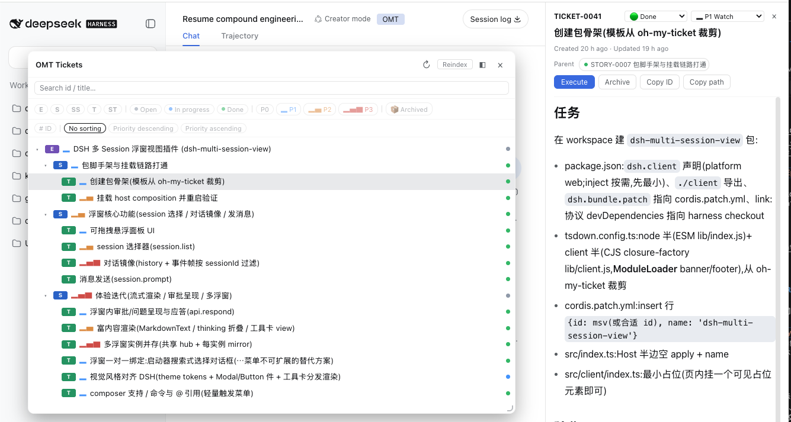

# Oh-My-Ticket (OMT)


**DSH 的 ticket 管理插件**：`Epic → Story → [SubStory] → Ticket → [SubTicket]` 五级任务体系，
SQLite 存元数据与层级关系，Markdown 存正文。ticket 随项目走（`.omt/` 目录可直接进 git），
模型通过工具创建/推进，人通过三种可切换的 UI 展现方式浏览与管理；
run 机制支持把一批 ticket 交给模型批量执行，全程有状态机、进度与信任策略兜底。
插件启用后，完整 OMT 操作规范默认写入系统提示，不必先 load `omt` skill。
设置页可追加约定，并从已装 skill 勾选拆票 skill；实质性开发（新功能 / 重新对接 / 改造）以及提到 ticket / 拆任务 / 节点 id 时进入 OMT 阶段并 load 绑定 skill。



## ✨ 功能特性

### 三种展现方式，一键切换

同一份 ticket 树，三种外壳共享同一套过滤/排序/搜索交互：

- **左侧抽屉**：`shell.overlay` 浮层，顶部 OMT 按钮开合，宽度可拖拽记忆
- **浮窗**：自由拖拽移动、右下角缩放，位置尺寸持久化；浮窗激活时 OMT Tab 自动隐藏并回退 Chat
- **OMT Tab**：注册进会话视图环，与 Chat ｜ Trajectory 并列，可"弹出为浮窗"

### 完整的树交互

- 类型徽章（E/S/SS/T/ST）、状态点（归档空心化）、优先级信号条（P1–P3 渐强着色）
- 搜索、类型/状态/优先级多选过滤、优先级排序、编号显示开关；过滤器状态
  自动保存到工作区 `.omt/ui-filters.json`，刷新自动恢复，面板内一键重置
- 归档独立维度（与生命周期状态正交，归档只读）、折叠状态跨会话记忆
- 窄视口适配（<640px 抽屉全宽、拖拽把手退役）、键盘焦点环规范
- 变更即时推送：自有 SSE 通道（`/omt/events`），模型改完 UI 立刻刷新

### 文档详情面板

- 选中节点即在右侧 details 列打开完整文档（动态遮蔽，关闭自动恢复原工具详情）
- 标题/状态/优先级/归档操作、追加进度记录、相对时间展示
- "执行"按钮：把 ticket 引用进输入框提交执行，执行中状态展示并锁定面板操作

### 模型与 UI 双向联动

- `@` 输入触发器：引用 ticket 进对话（候选排序 + 状态着色）
- 输入框上方引用条、激活 ticket 状态条
- 每轮对话末尾自动展示"相关 ticket"列表（来源：`@` 引用 ∪ 工具调用 ∪ UI 操作）

### Workspace 归属

- 工作区根目录存在 `.omt/` 时 ticket 随项目走（可进 git），否则回退全局 home
  （插件 config > `OMT_HOME` > `~/.omt`）
- 创建 Epic 时弹窗选择归属；id 跨 home 全局唯一
- 树跟随当前会话的工作区自动切换

### Run 批量执行

把一批 Ticket/SubTicket 快照成有序 run，交给模型逐项认领、执行、如实报告：

- **item 状态机**：`pending → running → done / failed / blocked / skipped / interrupted`，
  另有信任策略态 `awaiting_confirmation`——非 report 的裸 done 需人在 run 详情确认或打回
- **续跑**：run 可 pause/resume，interrupted 项 retry 后重新入队；idle 续跑 nudge 自动提醒
- **UI 联动**：Runs 区块展示列表/详情/进度统计，树行"▸▸"一键加入 run；
  从 UI 触发「开始执行」会自动唤醒执行会话进入 claim 循环
- **执行上下文注入**：claim 成功即时读取祖先链（Epic → Story → SubStory → 父 Ticket）
  正文作为只读背景返回，16 KiB 预算内最近父级优先，截断显式标记，单点读取失败降级不阻塞
- **祖先激活**：ticket 开工（置 in_progress 或 claim 成功）自动点亮仍为 open 的
  祖先链；done/blocked/skipped 祖先永不重开，归档祖先静默跳过

## 🤖 模型工具

| 工具 | 用途 |
|---|---|
| `omt_create` | 创建节点（Epic/Story/SubStory/Ticket/SubTicket），层级合法性校验 |
| `omt_list` | 列出节点（类型/状态过滤，关键词搜索） |
| `omt_show` | 节点详情（元信息、正文、父子清单），toolview 渲染为 Markdown 文档 |
| `omt_update` | 标题/状态/优先级/归档，替换正文或追加进度记录 |
| `omt_move` | 移动节点（连同子树） |
| `omt_reindex` | 磁盘 markdown 手工修改后重建 SQLite 索引 |
| `omt_run_create` | 创建 run：按顺序快照 Ticket/SubTicket 为执行批次 |
| `omt_run_list` | 列出 run（状态过滤 + 成员进度统计） |
| `omt_run_show` | 查看 run 详情：配置、成员状态、执行者谱系、attempts、last_error |
| `omt_run_control` | start / pause / resume / cancel / retry(nodeId) / remove(nodeId) |
| `omt_run_claim` | 原子认领下一项并绑定执行者；返回只读祖先上下文，激活 open 祖先 |
| `omt_run_report` | 报告单项结果（done/failed/blocked/skipped），note 记入 ticket 进度 |

内嵌两个 skill：`omt` 教 ticket 体系操作规范与状态流转约定，`omt-runs` 教
run 批次纪律（创建/认领/报告/续跑响应）。

运行时配置（home / runtime dir）的解析契约见
[docs/runtime/config.md](docs/runtime/config.md)——参数 > 环境变量 >
默认值，多端一致，由跨层 parity 测试锁定。

## 📦 安装

```sh
# 本仓库构建并打包：
pnpm install && pnpm build && npm pack    # → dsh-oh-my-ticket-0.6.3.tgz

# 安装进目标 DSH profile（profile 的 dsh.profile.bundles 依次为）：
#   @deepseek-ai/dsh-base, @deepseek-ai/dsh-web-app, dsh-oh-my-ticket
pnpm dsh plugin --profile <profile> add /path/to/dsh-oh-my-ticket-0.6.3.tgz

# 或直接从 npm 安装已发布版本：
pnpm dsh plugin --profile <profile> add dsh-oh-my-ticket@0.6.3
```

daemon 二进制随主包以 optionalDependency 自动带入（`@oh-my-ticket/darwin-arm64`），
也可经 brew / install.sh / GitHub Release 独立获取。

在工作区根目录 `mkdir .omt` 即可让该项目拥有独立的 ticket 库（随项目进 git）。
安装/升级后需重启 `dsh web` 进程，新版本的工具与 UI 才会生效。

## 🛠 开发

### 安装依赖

`@deepseek-ai/*` 依赖自 0.1.2-alpha.x 起已发布到 npm，克隆仓库后直接：

```sh
pnpm install
```

host 半构建会把 `dsh-tools` / `schemastery` / `cosmokit` 内联进 `lib/index.js`
（发布包自包含，运行时不再解析任何 `@deepseek-ai/*`）；浏览器半的
`ui-primitives` / `ui-slots` 是运行时外部依赖（模块表提供），不安装、
类型由 `src/client/externals.d.ts` 的结构化声明提供。

### 日常开发

```sh
pnpm build        # lib/index.js（host 半）+ lib/client.js（浏览器半）
pnpm watch        # 增量重建
pnpm typecheck    # tsc --noEmit
pnpm test         # vitest（314 例）
pnpm sync-version 0.6.2   # 统一升级四端版本号（Cargo.toml 为权威源）
```

### 仓库结构

```
├── package.json          # dsh.bundle + dsh.client 双 manifest
├── cordis.patch.yml      # 组合层：insert omt 行
├── tsdown.config.ts      # host 半 + client bundle 构建
├── src/
│   ├── index.ts          # host 插件入口（home 解析 + core 装配 + 工具/skill/hook 注册）
│   ├── host/
│   │   ├── core/store/markdown/files/pool   # 数据核心：SQLite + Markdown 双写、多 home 池
│   │   ├── rpc/events/changes               # 浏览器通道：RPC 端点 + SSE 变更推送
│   │   ├── tools/skill                      # omt_* 工具面 + omt / omt-runs skill
│   │   ├── running/recent/idle-hook/disposed-hook/notify-hook   # 执行态与提醒
│   │   └── ui-state.ts                      # 过滤器持久化（ui-filters.json）
│   └── client/
│       ├── index.ts      # 浏览器半入口（slot 注册装配）
│       ├── controller.ts # snapshot stores 与全部异步流
│       └── components/   # TicketPanel（共享树面板）+ Drawer/FloatWindow/TicketTab 三壳
│                         # + DocPanel/RunsView/RunPicker/TurnTickets 等
├── crates/               # Rust 工作区：omt-runtime（daemon）/ omt-client / omt-storage 等
├── packages/client-ts/   # TS daemon 客户端（discover-or-spawn、握手、RPC、事件流重放）
├── apps/desktop/         # Tauri 桌面端
├── tests/                # vitest 单测（连同 packages/client-ts 共 28 文件 / 314 例）
└── .omt/tickets/         # 本项目的 ticket 库（SQLite 索引已 gitignore，可 omt_reindex 重建）
```

## 📚 设计文档

- 可行性分析：[`FEASIBILITY.md`](FEASIBILITY.md)
- 代码证据调研：[`RESEARCH-dsh-ticket-plugin.md`](RESEARCH-dsh-ticket-plugin.md)
- 执行计划：[`EXECUTION-PLAN.md`](EXECUTION-PLAN.md)
- 开发笔记：[`docs/dsh-plugin-dev-notes.md`](docs/dsh-plugin-dev-notes.md)

## License

[MIT](LICENSE)
