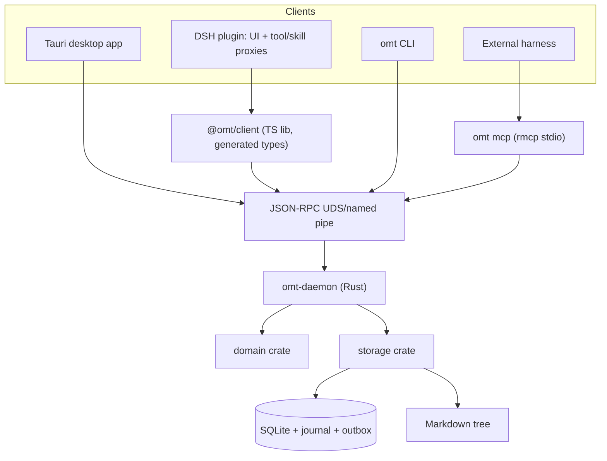

# OMT Rust Core and Desktop - Plan v2

## Goal Capsule

- **Objective:** Re-implement the OMT data core in Rust as a single-writer local daemon with RPC, CLI, and MCP access; shrink the DSH plugin to UI plus thin proxies; add a Tauri desktop application for ticket tree and detail.
- **Supersedes:** `docs/plans/2026-08-21-1619-refactor-omt-general-runtime-plan.md` (v1). Carrier-independent requirements R1-R22 and their semantics carry forward; TypeScript package topology and all TS implementation units are retired. The v1 decision "no generic UI in v1" is superseded by the Tauri desktop application (recorded as a direction change under KTD6).
- **Authority hierarchy:** This plan defines target behavior; existing node/run semantics in `src/host/core.ts` and its vitest suite (baseline pinned during U2) are the behavioral specification to port; existing DSH UX, tool names, and `.omt` on-disk formats remain the compatibility baseline.
- **Execution profile:** Cross-language rewrite (TypeScript core to Rust), protocol contract extraction, storage-format preservation with one schema migration, new desktop client, and DSH adapter slimming.
- **Stop conditions:** Stop before cutover if Markdown output cannot be kept byte-stable across the YAML serializer change without a documented normalization strategy, if the TS behavioral corpus cannot be frozen into language-neutral fixtures, or if cross-language home takeover cannot be made fail-safe.
- **Tail ownership:** The implementation owns fixture extraction, the Rust port, daemon lifecycle, takeover tooling, DSH adapter conversion, CLI, Tauri application, MCP exposure, binary distribution, and release documentation.

---

## Product Contract

### Summary

OMT becomes a Rust single-writer runtime (`omt-daemon`) speaking a versioned JSON-RPC protocol over OS-local sockets, with a first-class CLI and an embedded MCP server. The DSH plugin keeps its browser UI and model-facing `omt_*` names but delegates every data operation through RPC. A Tauri desktop app provides ticket tree and detail views against the same daemon. Markdown files remain Git-friendly and hand-editable; existing homes migrate in place.

### Problem Frame

The current core is embedded in each DSH process. Only DSH can operate tickets; there is no CLI, no desktop experience, and no way for another harness to share one home safely. v1 planned a TypeScript daemon, but a Rust implementation better serves the new goal set: one static binary that DSH, CLI, Tauri, and MCP consumers all launch without a Node runtime dependency, with native sidecar support in Tauri.

The rewrite risk concentrates in behavior fidelity (run state machine, trust gate, passive observation) and serialization stability (YAML frontmatter byte drift would dirty every ticket file in git). This plan treats those as first-class gates, not afterthoughts.

### Key Decisions

- KTD1. **Single-writer Rust daemon is the product boundary.** `(session-settled: user-approved — carried from v1: multiple harness processes must not write the same home independently.)` One `omt-daemon` process owns each opened home; per-home locks and owner markers reject other writers, whether legacy TypeScript or a second daemon. Governs R1, R2.
- KTD2. **Contract-first versioned protocol.** JSON Schema documents are the single source of truth for commands, queries, events, problems, capabilities, and the action-parity classification; TypeScript and Rust bindings are generated from them. Transport is JSON-RPC 2.0 over Unix domain socket (POSIX) and named pipe (Windows). Governs R3, R4, R5, R22.
- KTD3. **Rust implementation of the core.** `(session-settled: user-directed — chosen over continuing the v1 TypeScript daemon refactor: one static binary serves CLI, desktop, DSH, and MCP with no Node runtime dependency.)` Domain, storage, journal, leases, events, and migrations are Rust crates. TypeScript remains only for the DSH adapter and its browser bundle. Governs R1, R16.
- KTD4. **CLI is a first-class consumer.** `(session-settled: user-directed — chosen over CLI-as-afterthought: daily operation and debugging need scriptable access without any GUI or harness.)` The same crate exposes `omt` management and operation commands; offline maintenance commands acquire exclusive ownership instead of bypassing the daemon. Governs R15, R17.
- KTD5. **DSH thins to connection manager plus proxies.** `(session-settled: user-directed — chosen over keeping the embedded TypeScript core: the host half keeps tools, skills, UI, SSE, and notification mapping but no longer opens SQLite or Markdown directly.)` Epic scope choice stays a DSH-side dialog and reaches the runtime as an explicit authorized home. Subagent final-report extraction stays DSH-side because it reads Cordis session events. Governs R13.
- KTD6. **Tauri desktop application is the second UI.** `(session-settled: user-directed — supersedes v1's no-generic-UI decision: tree and detail move into a Tauri app whose components reference DSH styling concepts without reusing DSH slot/UI systems.)` It consumes the same daemon via an embedded sidecar binary and never opens storage directly. Governs R15, R18.
- KTD7. **MCP stays at the edge, embedded in the daemon binary.** An `omt mcp` stdio subcommand serves the portable agent subset using the official Rust MCP SDK; it holds least-privilege credentials and never defines domain semantics. Governs R14, R22.
- KTD8. **Storage semantics carry over unchanged in requirement form.** Operation-journal saga phases (`prepared → files_applied → db_committed → acknowledged`), fenced executor leases, durable outbox events with cursors, ledgered migrations, future-schema preflight, consistent home-bundle backups, and quarantine-based reindex are re-implemented in Rust per v1's reviewed designs. Governs R6-R11, R19, R23.
- KTD9. **Security control plane carries over.** Bootstrap lock, atomic generation descriptor, server-derived scoped credentials separating principal/actor/administrator, canonical-path containment, resource limits, and secret redaction follow v1's reviewed design; the OS account remains the hard local trust boundary. Governs R12, R20, R21.

### Actors

- A1. **OMT user:** Edits tickets by hand or through any client; expects Git-clean diffs and lossless migration.
- A2. **DSH adapter:** Browser UI unchanged; host half proxies tools/skills/hooks over RPC.
- A3. **CLI user:** Runs `omt` commands for CRUD, run operations, reindex, doctor, and daemon control.
- A4. **Desktop user:** Browses and edits trees/details in the Tauri application.
- A5. **External harness:** Consumes the portable subset through MCP stdio.
- A6. **omt-daemon:** The only writer; owns discovery, serialization, migration, recovery, events, and leases.

### Requirements

#### Runtime boundary and contracts

- R1. Domain, storage, and server crates must not depend on any harness, GUI framework, or network-facing service beyond the local transport; the DSH adapter must not open SQLite or Markdown directly.
- R2. One daemon owns every opened home; per-home locks and owner markers reject legacy writers and second daemons, including during cross-language transition.
- R3. Commands, queries, events, problems, handshake, and capability data must come from one versioned JSON Schema source with generated TypeScript and Rust bindings.
- R4. Public references must include a stable `homeId`; bare IDs remain a DSH-adapter compatibility input resolved with explicit workspace context; create commands require an explicitly authorized home.
- R5. Errors must carry stable machine-readable codes and details; message text is diagnostic only.

#### Port fidelity and persistence

- R6. Existing Markdown layout, managed child blocks, workspace `.omt` directories, global homes, hand editing, and explicit reindex behavior must be preserved.
- R7. A mutation may return success only after SQLite state, idempotent result, durable event set, and file recovery conditions are committed; acknowledged mutations roll forward only.
- R8. Migrations use a ledger, run under exclusive ownership, reject newer schemas before any write-capable step, verify invariants, and preserve a restorable DB-plus-Markdown bundle of existing v1-v3 homes.
- R9. Mutations support idempotency keys and optimistic revision checks.
- R10. Claim atomically validates run state and assigns a fenced lease (principal, actor namespace, attempt, secret token); report/renew/release are lease-fenced; human administration is a separate audited capability.
- R11. Events have durable per-home cursors, bounded retention, replay, snapshot-resync signaling, and attention payloads carrying required action, qualified reference, reason, deadline, and recovery options without lease secrets.
- R12. Identity separates connection principal, delegated actor namespace, and administrator capability; adapters may never submit unrestricted actor strings.
- R19. Reindex produces a deterministic zero-write dry-run plan; missing active members are quarantined with identity snapshots preserved; nothing is silently deleted or rebound.
- R23. For content the runtime does not change, Rust-written Markdown must remain byte-identical to TypeScript-written output, proven by golden snapshots covering CJK, emoji, quoting, colons, long lines, and frontmatter ordering; any unavoidable normalization ships as a documented one-time migration commit.

#### Harness integration

- R13. The DSH adapter preserves `omt_*` tool names, embedded skills, workspace routing, browser UI, `/omt` RPC projections, SSE refresh, followup/inject delivery, and the epic scope dialog while delegating all data operations over RPC with server-derived identity.
- R14. MCP exposes the portable agent-action subset with structured outputs, stable errors, capability discovery, and stdio transport; the CLI covers full management and operations.
- R15. The CLI and the Tauri application together prove non-DSH consumption: CLI proves CRUD, run claim/report, event resume, and maintenance; Tauri proves tree/detail browsing, edits, and live updates.
- R22. An action-parity matrix classifies every action as agent-available, adapter-only, or human-administrative; agent-available actions expose identical qualified context everywhere.

#### Packaging and compatibility

- R16. The repository hosts a Cargo workspace (crates under `crates/`, generated bindings published as packages) alongside the existing root npm package; nothing outside the DSH package requires a DSH checkout.
- R17. Existing installations have a two-stage path: a final lock-aware TypeScript release, then daemon takeover that preserves package name, tool names, ticket IDs, Markdown paths, and run records; distribution starts with platforms having evidenced consumers (initially macOS arm64), delivered via optional-dependency packages for npm consumers and GitHub Releases archives/checksums; additional targets enter on demonstrated demand and are listed as unsupported until then; Tauri bundles embed the daemon sidecar.
- R18. Release documentation states supported Node (for the adapter), Rust targets, OS platforms, protocol/schema versions, DSH compatibility range, and MCP protocol level, and claims exactly what the desktop app supports.
- R20. Every principal has explicit home and operation capabilities; paths are canonicalized and contained against traversal, symlink, junction, hardlink, and replacement escapes.
- R21. The daemon enforces bounded payload, connection, queue, home, search, reindex, event, idempotency, log, and disk-retention limits.

### Key Flows

- F1. **Discovery and connect:** Any client finds a live daemon via the per-user descriptor or spawns one detached (bootstrap lock elects the winner); handshake negotiates protocol/capabilities; scoped credential issuance follows; the requested home resolves to a stable `homeId`. Covers R2, R3, R4, R12.
- F2. **Recoverable mutation:** Queue → validate idempotency/revision/authorization → journal `prepared` → atomic file plan with hashes and directory fsync → single transaction committing rows, result, and outbox → acknowledge; crash before acknowledgement replays deterministically, after acknowledgement rolls forward. Covers R5, R7, R9, R23.
- F3. **Leased execution:** Claim validates run status inside the transaction, assigns lease+attempt; heartbeats renew; report is accepted only from the matching lease or audited administration; expiry/release/interrupt follow v1 janitor semantics expressed as lease operations. Covers R10, R12.
- F4. **Event fan-out:** Committed events persist with cursors; DSH maps attention payloads to followup/inject; Tauri and CLI resume from stored cursors; retention expiry triggers snapshot resync. Covers R11, R13, R15.
- F5. **Cross-language takeover:** The lock-aware TypeScript bridge release honors owner markers; operators verify quiescence; the daemon backs up the whole home bundle, migrates v3→v4, verifies invariants, and assumes ownership; unknown unupgraded writers remain an explicitly documented limit. Covers R2, R8, R17.

### Acceptance Examples

- AE1. Concurrent clients (DSH + CLI) create and revision-check-update one home without duplicate IDs, lost writes, or git-visible churn. Covers R2, R4, R9.
- AE2. Crash injection at every journal/file/transaction/acknowledge boundary converges; acknowledged results never revert. Covers R7.
- AE3. Pause racing claim linearizes; no claim lands after pause commits. Covers R10.
- AE4. Stale attempt-one reports against attempt-two are rejected. Covers R10.
- AE5. Event consumers reconnect from cursors or receive resync signals. Covers R11.
- AE6. A real v3 home migrates with nodes, bodies, paths, IDs, runs, attempts, and counters intact; rollback restores the whole bundle. Covers R8, R17.
- AE7. Future-schema homes fail open attempts with `SCHEMA_TOO_NEW` leaving DB, WAL/SHM, and files byte-unchanged. Covers R5, R8.
- AE8. DSH smoke passes tools, skills, UI, references, notifications through the thin adapter. Covers R13.
- AE9. CLI completes create→run→claim→report→reindex offline and online; Tauri browses and edits live. Covers R14, R15.
- AE10. Cross-principal, traversal, symlink, and path-swap attacks fail closed. Covers R12, R20.
- AE11. Bootstrap races elect one generation; stale descriptors, old credentials, and quota abuse degrade safely. Covers R12, R21.
- AE12. Administration confirm/override is denied to normal principals and audited when used. Covers R10, R12.
- AE13. Golden serialization snapshots: Rust rewrites of TypeScript-authored fixtures are byte-identical, including CJK/emoji/quoting cases. Covers R23.
- AE14. The frozen behavioral corpus passes identically on TypeScript (pre-cutover) and Rust (post-port); any divergence blocks cutover. Covers R1, R6-R10.

### Success Criteria

Blocking gates (Done-gating): multi-client correctness up to 8 opened homes × 2,000 nodes × 4 concurrent authenticated clients × 5 active runs of 200 items; the crash-recovery kill-point grid; SIGKILL-to-ready <5 s with converged state. Benchmark tier (reported, not Done-gating until promoted on recorded production-scale evidence): 10k-command mixed stress at a 1:4 mutation/query mix, 30-minute soak at ≥20 cmd/s aggregate with p95 interactive latency <100 ms, 100k retained events with sub-2 s resume of a 10k delta. All AE gates pass; the DSH suite stays green pre-cutover and the parity corpus proves equivalence post-port; packed artifacts install without DSH checkouts.

### Scope Boundaries

Included: Rust crates (contracts/domain/storage/runtime; MCP embedded per KTD7), contracts+codegen, TS client library, DSH adapter slimming, takeover tooling, Tauri desktop app, binary distribution, docs. Deferred: remote/network deployment, multi-user tenancy, true parallel run concurrency (>1 stays rejected), Tauri auto-update pipelines, mobile. Outside identity: making Markdown disposable, or letting MCP shape the domain model.

### Dependencies

- Rust stable toolchain; rusqlite (bundled SQLite); tokio; a maintained JSON-RPC layer; rmcp (official Rust MCP SDK, [modelcontextprotocol/rust-sdk](https://github.com/modelcontextprotocol/rust-sdk)); Tauri 2 ([sidecar embedding](https://v2.tauri.app/develop/sidecar/)); schema-first codegen consuming JSON Schema documents (typify for Rust types; a schema-consuming TypeScript generator).
- Existing DSH Cordis services only inside the DSH adapter.

---

## Planning Contract

### Key Technical Decisions

See Product Contract Key Decisions KTD1-KTD9; they are the governing technical decisions for this plan.

### High-Level Technical Design

Repository layout: root npm package unchanged (DSH adapter, name `oh-my-ticket`); `crates/` Cargo workspace (`omt-contracts`, `omt-domain`, `omt-storage`, `omt-runtime`; the runtime crate exposes both the `omt-daemon` and `omt` bins and hosts MCP per KTD7); `packages/client-ts` generated TS client; `schema/` JSON Schema source of truth. Daemon lifecycle: clients spawn `omt-daemon` detached when the descriptor is absent/stale; bootstrap lock elects one winner; idle shutdown after a configurable quiet period with graceful drain; upgrades use generation replacement; crash recovery precedes readiness. Logs go to a per-user runtime directory with size-capped rotation; quiet-period and limit configuration lives beside the descriptor; the desktop app spawns the daemon detached exactly like other clients; on restart, items holding unexpired leases resume while expired ones demote to interrupted.

Serialization stability: the Rust markdown codec mirrors js-yaml dump conventions (quote selection, line width −1, key order, unicode handling), locked by golden snapshots generated once from the TypeScript implementation across adversarial bodies plus a CI differential harness feeding randomized adversarial scalars through both implementations; pinned dump conventions (options, key order, trailing newline) sit beside the snapshots; divergence fails CI.

### System-Wide Impact

- **Data lifecycle:** Runs stay DB-only; backup/restore documentation must treat the home as a bundle. Byte-stability protects git workflows; any serializer normalization is a visible, one-time commit.
- **Identity:** Qualified refs become the wire truth; DSH alone translates legacy bare IDs.
- **Process model:** DSH loses in-process calls; cancellation (`exec.signal` → RPC cancel), daemon-absent degradation, and reconnect UX are new adapter responsibilities.
- **Notifications/hooks:** idle/disposed/notify logic becomes attention-event subscription plus DSH-side delivery; subagent final-report extraction remains DSH-side.
- **Distribution:** Targets enter on evidenced demand (macOS arm64 first); npm optional-dependency packages mirror the esbuild pattern; GitHub Releases carry archives/checksums; Tauri bundles embed the daemon sidecar.

### Risks and Mitigations

- **Behavior drift in port:** Freeze the language-neutral corpus first (U2); differential-run TS vs Rust until zero divergence; block cutover otherwise.
- **YAML byte drift:** Golden snapshots + js-yaml-convention codec (U4); fallback normalization strategy documented and gated (stop condition).
- **Cross-language co-writing:** Lock-aware TS bridge (U2) plus takeover tooling (U6); takeover refuses non-quiescent homes.
- **Daemon lifecycle gaps:** Lifecycle decisions fixed in this plan (spawn/detach/election/idle/drain/generation/crash); verified in U5 tests and docs.
- **Distribution weight:** Platform matrix automated early (U10 smoke) to avoid late packaging surprises.
- **Scope pull of the desktop app:** Tree/detail feature list fixed for v1 (below); anything else defers.
- **Unsupported concurrency promise:** Capability advertises `runConcurrency: 1`; larger values rejected.

### Sequencing

1. Contracts, codegen, parity-matrix seed.
2. Freeze behavioral corpus; ship lock-aware TypeScript bridge release.
3. Port domain to Rust against in-memory ports; pass corpus.
4. Implement Rust storage/journal/outbox/migrations/locks; byte-stability goldens.
5. Build daemon, transports, TS client lib, and CLI; prove multi-process correctness.
6. Convert the DSH adapter onto RPC and verify it end-to-end before any real home changes hands.
7. Execute quiescent takeover and migration rollout.
8. Build the Tauri desktop application.
9. Embed the MCP stdio server.
10. Package binaries, document, canary, release.

---

## Implementation Units

### U1. Contracts, codegen, and parity seed

- **Goal:** Establish the cross-language protocol source of truth.
- **Requirements:** R3, R4, R5, R16, R22.
- **Files:** `schema/*.schema.json`, `crates/omt-contracts/src/**`, `packages/client-ts/src/generated/**`, `scripts/gen-bindings.*`, tests `crates/omt-contracts/tests/**`, `packages/client-ts/tests/**`.
- **Approach:** Author JSON Schemas for DTOs, envelopes, problems, capabilities, events, and the action-parity classification; generate Rust types and TS types/bindings; define qualified refs and the subdivided error-code registry (enriched by U2's pre-freeze pass) inherited from v1's problem list.
- **Test Scenarios:** Round-trip validation both languages; unknown-field tolerance for additive changes; unsupported-major negotiation yields `UNSUPPORTED_PROTOCOL`; malformed `homeId` rejected; error assertions use code/details only.
- **Verification:** Generated packages compile and pack standalone.
- **Dependencies:** None.

### U2. Behavioral corpus freeze and lock-aware TypeScript bridge

- **Goal:** Pin current behavior as the port spec and prepare homes for handover.
- **Requirements:** R6, R13, R17, R23 (fixture-extraction basis).
- **Files:** `corpus/scenarios/*.json`, `corpus/runner/ts/*`, `src/host/store.ts`, `src/host/core.ts`, release notes entry.
- **Approach:** Pin the baseline at a recorded commit hash, then extract characterization scenarios into plain, self-describing `{setup, operations, invariants}` JSON (no extensible runner framework) runnable by both languages, with clock injection and volatile-field masking (`created_at`/`updated_at`/`nudged_at`) defined in the envelope. Split sources deliberately: `core.spec.ts`, `run-core.spec.ts`, `archived.spec.ts` port fully; `pool.spec.ts` contributes only the workspace-routing half that moves into the daemon; hook specs contribute only core-visible halves (nudge records, stall transitions, sweep outcomes driven by injected operations) while pure followup/inject delivery assertions stay permanent TS suites outside the corpus; `run-store.spec.ts` scenarios get an explicit seed primitive replacing direct `OmtStore` writes. Before freezing, subdivide coarse error codes and add structured details in the TypeScript core (for example `ARCHIVED_READONLY`, `DUPLICATE_MEMBER`, `INVALID_CONCURRENCY`), migrate spec assertions to codes/details, and hand the enriched taxonomy to U1. Janitor session-liveness cases are re-expressed as lease-heartbeat/expiry equivalents agreed as U3 semantics prior to freeze. Ship the final TypeScript release whose storage layer creates/honors the new owner-lock format, detects a daemon owner marker, and refuses conflicting writers.
- **Test Scenarios:** Corpus executes green on TS today; lock-aware build passes the enriched suite; concurrent old-vs-new open fails closed on the newer lock.
- **Verification:** Corpus committed with a pinned TS runner result; bridge release tagged.
- **Dependencies:** None.

### U3. Rust domain crate

- **Goal:** Port hierarchy/status/run/lease-decision semantics pure and testable.
- **Requirements:** R1, R10, R23 (decision-logic fidelity).
- **Files:** `crates/omt-domain/src/**`, `crates/omt-domain/tests/**`, `corpus/runner/rs/**`.
- **Approach:** Pure decision functions for node hierarchy/archive rules, run/item transitions, terminal derivation, stop-on-failure, retry/replay, trust-gate report authorization, and lease policy mirroring v1 semantics; in-memory ports drive the corpus runner (Rust leg).
- **Test Scenarios:** Full corpus green; property tests for transition legality; `concurrency > 1` rejected; stale-lease and foreign-actor reports denied; admin override distinct.
- **Verification:** `cargo test` green with zero harness dependencies.
- **Dependencies:** U2.

### U4. Rust storage crate: journal, migrations, locks

- **Goal:** Crash-recoverable dual-store persistence preserving formats.
- **Requirements:** R2, R6, R7, R8, R9, R19, R23.
- **Files:** `crates/omt-storage/src/{store.rs,markdown.rs,journal.rs,outbox.rs,recovery.rs,backup.rs,home_lock.rs,migrations/**,invariants.rs}`, tests `crates/omt-storage/tests/**`.
- **Approach:** rusqlite with WAL/busy_timeout; phased operation journal with file plans (temp write, fsync, rename, directory fsync, before/after hashes, recovery copies); single-transaction finalize of rows+result+outbox; ledgered v3→v4 migration (homeId, revisions, events, leases, member identity snapshots) behind read-only future-schema preflight; consistent bundle backup via SQLite backup API plus manifest; deterministic dry-run + quarantine reindex; fs4/fd-lock home ownership.
- **Test Scenarios:** v1/v2/v3 fixtures migrate losslessly; future-schema byte-stability; kill-point injection across create/update/move/report incl. multi-file moves with manual-drift fail-closed; backup restore of uncheckpointed-WAL fixture; quarantine of missing active member; golden YAML snapshots byte-identical vs TS outputs (CJK/emoji/quotes/long lines).
- **Verification:** Invariant checks green post-migration/recovery/reindex.
- **Dependencies:** U3.

### U5. Daemon, transports, TS client, CLI

- **Goal:** The runnable multi-client runtime.
- **Requirements:** R2, R3, R9, R11, R12, R15, R16, R20, R21.
- **Files:** `crates/omt-runtime/src/{server.rs,jsonrpc.rs,ipc.rs,auth.rs,discovery.rs,bootstrap.rs,homes.rs,limits.rs,events.rs,cli/**}`, `packages/client-ts/src/**`, tests `crates/omt-runtime/tests/**`, `packages/client-ts/tests/**`.
- **Approach:** JSON-RPC over UDS/named pipe; bootstrap lock + atomic generation descriptor + stale cleanup; peer-credential-checked enrollment issuing short-lived scoped secrets (actor namespaces, home scopes; admin non-delegable); per-home command queues; event notifications with cursor resume; limits/redaction; lifecycle per design section. CLI verbs: `list/show/create/update/move/reindex/doctor/run *` plus `daemon start/stop/status`; online via RPC, maintenance verbs take exclusive ownership.
- **Test Scenarios:** Spawn election races; stale descriptor/PID reuse; unauthorized minting/widening denied; two processes share one home correctly; retry-after-lost-ack returns prior result; cancel propagates without partial commits beyond linearization; quota/low-disk fair degradation; SIGKILL-restart <5 s ready; CLI offline maintenance acquires exclusive lock; event resume from cursor.
- **Verification:** Blocking envelope gates green; benchmark tier reported.
- **Dependencies:** U4.

### U6. Takeover rollout

- **Goal:** Move real homes onto the daemon safely.
- **Requirements:** R2, R8, R17.
- **Files:** `crates/omt-runtime/src/takeover.rs`, `docs/runtime/takeover.md`, tests `crates/omt-runtime/tests/takeover.spec.rs`.
- **Approach:** `omt doctor` reports writer cohorts detectable locally; `omt takeover <home>` verifies bridge-release lock state and quiescence, snapshots the bundle, migrates, fences ownership; refusal paths actionable. Executes only after U7's converted adapter passes end-to-end against a daemon-owned test home, so no production consumer loses access during rollout.
- **Test Scenarios:** Active legacy writer blocks takeover; interrupted migration restores bundle; post-takeover legacy open refused with guidance.
- **Dependencies:** U5, U7.

### U7. DSH adapter conversion

- **Goal:** Keep the DSH product surface; remove embedded storage.
- **Requirements:** R12, R13, R16, R17.
- **Files:** root package `src/index.ts`, `src/host/{service.ts,tools.ts,rpc.ts,events.ts,idle-hook.ts,disposed-hook.ts,notify-hook.ts,skill.ts}`, deletion of retired storage modules `src/host/{core,store,pool,changes,files,markdown}.ts` and their specs, `src/client/**` unchanged where possible, tests updated.
- **Approach:** Root package joins the pnpm workspace untouched in location/name/bundle shape; retired TS storage modules are deleted here so no direct-storage path survives. New host service owns client-lib lifecycle (spawn/connect, readiness, reconnect, disposal); tools register from generated schemas with names/renderers preserved; `/omt` request identity is translated server-side — each submitted `sessionId` is validated against live Cordis agents and workspace cwd resolves locally, then RPCs are issued under the adapter's own principal with per-agent actor namespaces, so caller-supplied identity never carries authority; endpoints authorize home/action, reject cross-origin/CSRF-style requests, and gate SSE subscription. Adapter-owned bags move into the daemon: new protocol commands `filters-get/set` and `recent-get/set` persist UI filters (migrating any existing `ui-filters.json` on first connect) and recent lists, so the adapter never writes inside daemon-owned homes. Hooks subscribe attention events → followup/inject; epic scope dialog stays.
- **Test Scenarios:** Existing tool/RPC/hook suites green against RPC backend; forged actor/session rejected; daemon-absent startup degrades with actionable error then recovers; SSE resumes across daemon restart; packaged browser bundle loads in DSH loader.
- **Dependencies:** U5.

### U8. Tauri desktop application

- **Goal:** Ship tree/detail as a native desktop client.
- **Requirements:** R15, R16, R18. `(user-reviewed 2026-08-24: full v1 feature set including human-driven claim/report and settings confirmed)`
- **Files:** `apps/desktop/**` (Tauri 2 project; frontend React+Vite referencing DSH styling concepts, not importing DSH slot/UI modules), tests `apps/desktop/tests/**`.
- **Approach:** Sidecar embeds only `omt-daemon` (the CLI binary is not bundled; the desktop needs no shell tool); app connects over local IPC with its own scoped principal and spawns the daemon detached, so closing the window never kills other clients' sessions. v1 features: workspace/home picker, ticket tree (search/filter/status/priority), detail view (frontmatter summary, body render, progress append, archive), runs list/detail with human-driven claim/report buttons and confirmation affordances, daemon status/settings. Live updates via event subscription.
- **Test Scenarios:** Cold start spawns sidecar and connects; tree/detail match daemon state after external CLI mutations; edit flows enforce revisions; run claim/report honor leases and show admin actions only when authorized; second instance shares the same daemon; package installs on supported targets.
- **Dependencies:** U5 (may proceed parallel to U7 after U5).

### U9. Embedded MCP server

- **Goal:** Portable harness access.
- **Requirements:** R14, R20, R21, R22.
- **Files:** `crates/omt-runtime/src/mcp.rs`, tests `crates/omt-runtime/tests/mcp.spec.rs`.
- **Approach:** `omt mcp` stdio subcommand using rmcp; tools generated from parity-matrix agent-available actions; least-privilege credential scoped to permitted homes; secrets never via argv/env inheritance beyond scrubbed allowlist; errors map to structured MCP failures.
- **Test Scenarios:** Tool list matches parity matrix; CRUD/claim/report flows succeed; cancellation clean; credential cannot administer or escape scoped homes; stderr free of secrets.
- **Dependencies:** U5.

### U10. Packaging, distribution, documentation, release

- **Goal:** Deliver installable binaries and operator-ready docs.
- **Requirements:** R16, R17, R18, R21.
- **Files:** `Cargo.toml` workspace profiles, `npm/platform-packages/**`, `.github/workflows/{ci,release}.yml`, `apps/desktop/tauri.conf.json`, `docs/runtime/{architecture,protocol,migrations,takeover,operations,security,compatibility,distribution}.md`.
- **Approach:** CI builds macOS arm64 first; further targets join only on demonstrated demand and unsupported ones are recorded in the compatibility doc; npm optional-dependency packages deliver binaries to DSH users; GitHub Releases publish archives/checksums; sidecar artifacts use target-triple naming and the signing/notarization strategy (or explicit unsigned limitations) is decided here; docs cover install, upgrade from v0.3.x, takeover, rollback, security model, CLI/MCP/desktop usage; canary stages DSH + CLI first, desktop evidence once U8 lands.
- **Test Scenarios:** Pack smokes install in empty Node project and DSH checkout; binary smoke on each supported target runs daemon+CLI; desktop bundle launches; unsigned-install limitations verified against documented claims; upgrade path from current release migrates a fixture home; docs match implemented behavior.
- **Dependencies:** U1-U9.

---

## Verification Contract

| Gate | Suite | Applies | Done signal |
|---|---|---|---|
| Workspace checks | `cargo fmt/clippy/test`, `pnpm -r typecheck test` | U1-U10 | All crates and TS packages green. |
| Parity corpus | `corpus` runner ×{ts,rust} | U2-U4 | Identical results; divergence blocks cutover. |
| Byte stability | golden snapshot suite | U4, U10 | Rust rewrites of TS fixtures byte-identical. |
| Migration matrix | fixture DBs v1-v3→v4, too-new, restore | U4, U6 | Lossless; unsafe paths fail closed. |
| Crash recovery | kill-point injection grid | U4-U6 | Convergence per R7; ack'd work rolls forward. |
| Multi-process stress | envelope suite | U5-U6 | Blocking envelope gates met; benchmark tier reported. |
| Security negatives | authz/path/credential/limit suites | U5, U7, U9 | AE10-AE12 style cases fail closed. |
| DSH compat | existing suites + browser smoke | U7 | Names/UI/notifications preserved over RPC. |
| Desktop e2e | Tauri suite | U8 | AE9 desktop leg green on targets. |
| MCP conformance | stdio suite | U9 | Parity-matrix subset green; no secret leaks. |
| Distribution | pack/install smokes per target | U10 | Binaries install and run; docs accurate. |

Legacy test deletion is allowed only with a corpus scenario or crate test proving the same behavior, mapped visibly.

---

## Definition of Done

- R1-R23 trace to passing units above; v1-carried semantics survive review citations where reused.
- `omt-daemon` is the sole production writer; bridge release, takeover, and rollback operate as documented, including the unknown-legacy-writer limitation.
- Existing homes migrate with zero content loss; Rust Markdown output is byte-stable or normalization is an explicit, documented migration commit.
- The behavioral corpus passes on both legs with zero divergence at cutover.
- Leases fence claims/reports; races closed; administration separated and audited.
- DSH retains tools/skills/UI/notifications through the thin adapter with server-side identity; no direct storage access remains.
- CLI performs full operational and maintenance duty; Tauri app delivers tree/detail/live-edit on supported platforms; MCP serves the agent subset.
- Binaries distribute via npm optional packages, Releases, and Tauri sidecar with checksums and per-target smokes.
- Docs cover architecture, protocol, security, migration/takeover, operations, compatibility, and distribution; canary evidence exists before stable tagging.
- The behavioral corpus has an executed post-cutover fate: promoted to canonical behavioral specification with legacy spec citations retired, or its TypeScript leg deleted after three stable releases.
