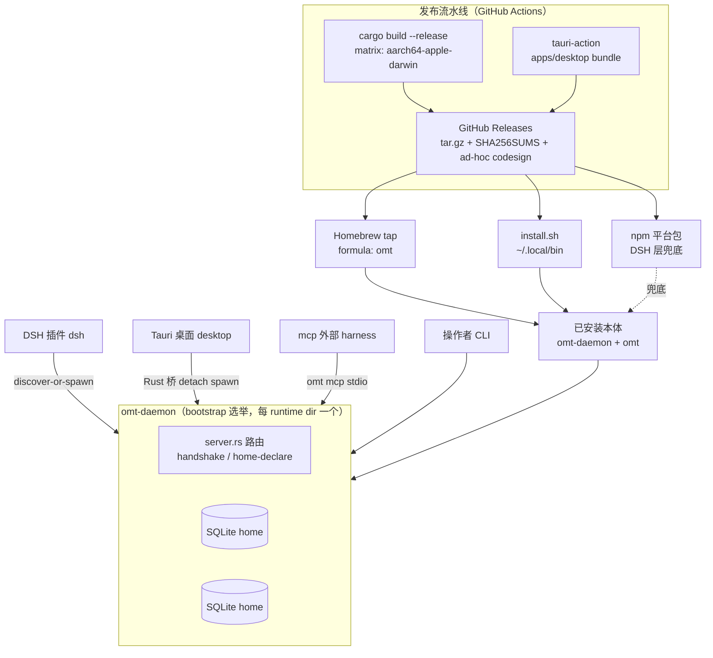
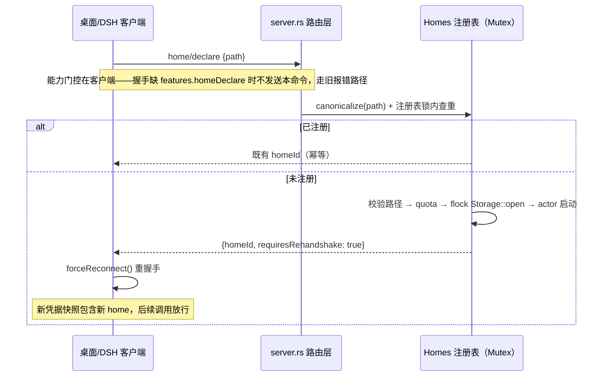

# 多端运行时契约、Tauri 桌面与分发体系 - Plan

## Goal Capsule

- **目标**：将 STORY-0036（Tauri 桌面应用）、STORY-0037（MCP 内嵌与打包发布）、STORY-0038（多端共用运行时的共享契约）共九张 ticket 落地为可执行计划：先固化三端共用 daemon 的使用契约，再交付桌面客户端与新分发体系。
- **权威层级**：本计划 Product Contract 的 R/KD 条目 > 九张 OMT ticket 正文 > 会话既定决策标注。执行中发现 ticket 正文与本计划冲突时，以本计划为准并回写 ticket 进度说明。
- **停止条件**：出现改变产品范围或推翻既定决策的证据（如 ad-hoc 签名策略被证实在目标场景不可用）时停下报告，不得静默改道。
- **执行画像**：`execution: code`；契约层测试先行（语料/集成测试已有成熟范式），打包层冒烟优先（安装/运行验证重于单测覆盖）。
- **收尾归属**：执行方负责每单元原子提交、验证门全绿、ticket 状态回写；本计划不定义发布时机。

---

## Product Contract

### Summary

本计划为「omt-daemon + omt CLI 是产品本体」的定位落地三块能力：(1) 把多端共用 daemon 的使用契约固化成文档、测试与两个协议增强（UI bag 键作用域、home 动态注册）加一个可观测性命令（doctor 版本报告）；(2) 在 `apps/desktop/**` 交付 Tauri 2 桌面客户端，sidecar 内嵌同源 Release 构建的 daemon，界面完全独立但概念与契约共享；(3) 以 GitHub Releases 为唯一事实源重组分发——Homebrew 与 install.sh 为产品渠道、npm 平台包降级为 DSH 适配层兜底，并交付 `omt mcp` stdio 服务与 staged canary 门禁。

### Problem Frame

项目已完成从 TypeScript 单体到 Rust core 的转换（EPIC-0009 U1-U7），当前只有 DSH 插件一个消费端。三个结构性缺口阻止产品化：其一，home 只能在 daemon 启动时以 `--home` 声明，「谁先拉起 daemon 谁决定可用 home 集合」，第二/第三消费端接入即碰壁；其二，配置解析规则在三处实现各自为政地正确着，没有任何东西阻止漂移，也没有权威文档；其三，分发基础设施为零（无 `.github/`、无安装脚本、无打包工具链），而定位已裁定为独立二进制产品而非仅 DSH 插件附件。桌面端与 MCP 是首批新增消费面，它们的存在反过来暴露并驱动前两个缺口的修补。

### Requirements

共享运行时契约（STORY-0038，TICKET-0133~0136）：

- R1. 配置解析统一规则写入单一权威文档：CLI 参数 > 环境变量 > 默认值；home 默认 `~/.omt`（env `OMT_HOME`）、runtime dir 默认 `~/.omt/run`（env `OMT_RUNTIME_DIR`）；多端契约要求所有 UI 层解析到同一 runtime dir。
- R2. 跨层 parity 测试锁定三处解析实现（Rust `paths::resolve`/server 启动参数、`packages/client-ts` 、DSH 适配器）防漂移，并锁定 descriptor 增量字段不变式（`schemaVersion === 1` 期间新增字段对 TS/Rust 双向安全）。
- R3. filters bag 键按 surface 前缀隔离：DSH 用 `dsh:` 前缀、桌面用 `tauri:` 前缀；规则写入 schema 方法描述与 parity 摘要；服务端本期不做强制校验。
- R4. recent 收敛为单一全局共享键 `recent`（行为变更：替换现状 per-sessionId 分键），跨端可见；孤儿键不迁移、不清理（无删除 RPC，文档记录即可）。
- R5. DSH legacy 裸键 `'ui'` 一次性迁移：读取时兼容回退 + 写穿透新前缀键；legacy 偏好文件导入器改为直写新前缀键。
- R6. 新协议命令 `home/declare` 幂等注册磁盘上已存在的 home 到运行中 daemon：路径规范化后在 Homes 注册表互斥锁内去重（并发声明返回既有 homeId）；能力经握手 `features.homeDeclare` 通告。
- R7. `home/declare` 授权面为 AgentAvailable（同 uid 已是信任边界）；MCP 最小权限凭据默认不授予 home 操作族。
- R8. declare 成功响应携带 `requiresRehandshake: true`；TS 客户端复用既有 `forceReconnect` 自愈模式重握手，使存量会话获得新 home 授权。
- R9. declare 失败透传既有 problem 语义：外部 daemon 占用 → `DAEMON_OWNS_HOME`（含 owner pid）、ts-bridge 标记 → `HOME_LOCKED` 并指引 `omt takeover`（不自动抢夺）、目录无效/缺失 → 打开前校验拒绝、超配额 → `QUOTA_EXCEEDED`。
- R10. `omt doctor` 版本一致性报告：增加锁-free 在线前导段（读 descriptor + 完成一次握手取 `daemon.version`）与自身版本比较；旧 daemon 缺字段时报 unknown 不报错；深度探测保持 `refuse_if_served`。同时报告 `admin-grants.json` 中 pid 已死的授权条目作为清理 cohort。

Tauri 桌面应用（STORY-0036，TICKET-0125~0126）：

- R11. `apps/desktop/**` Tauri 2 工程（React+Vite）加入 pnpm workspace（新增 `apps/*` member）；表现层完全独立，不复用 DSH slot/UI 模块。
- R12. sidecar 仅内嵌 `omt-daemon`，取自与发布渠道相同的 Release 构建产物（构建期按 target-triple 后缀命名放入约定目录）；补齐 `tauri dev` 不复制 externalBin 的缺口。
- R13. daemon 由 src-tauri Rust 层 detached spawn（`process_group(0)` 分离）：窗口关闭/应用退出不杀共享 daemon，收敛交给既有选举与空闲退出机制；第二实例发现存活 daemon 后直接复用。
- R14. 桌面以 `ClientKind::desktop` 自有 scoped principal 握手（auth 层已预埋该枚举）。
- R15. 工作区 home 选择器对未注册 home 调 `home/declare`（连上不支持该能力的旧 daemon 时回退为现有错误提示文案）；ts-bridge 标记的 home 拒绝声明并指引 takeover。
- R16. tree/detail/edit/run 完整 UI：树（搜索/过滤/状态/优先级）、详情（frontmatter 概要/正文渲染/进度 append/归档）、实时更新订阅、编辑 revision 冲突提示刷新、runs 列表/详情与人工 claim/report（含确认流、遵守 lease）、admin 操作仅授权态可见、设置页；v1 保留完整功能集（上游已裁定）。
- R17. 桌面偏好持久化遵守键作用域契约：filters 经 `ui/filters-*` 用 `tauri:` 前缀键，recent 读全局共享键。

MCP 与分发（STORY-0037，TICKET-0127~0129）：

- R18. `omt mcp` stdio 子命令（rmcp crate）：工具从 parity 矩阵 agent-available 动作生成；最小权限凭据限定允许的 homes 且不含 home 操作族；secrets 不经 argv/stderr 泄露；错误映射为结构化 MCP failure；stderr 保持无 secret。
- R19. GitHub Releases 为唯一事实源：CI 构建 macOS arm64 首发，产出 target-triple 归档（内含 `omt-daemon` + `omt` 双二进制）+ SHA256SUMS + ad-hoc codesign；签名身份经 `APPLE_*` 环境变量注入即自动启用 inside-out 重签与公证（不注入则整体跳过签名）；桌面 bundle 作为同一 workflow 的矩阵 job。
- R20. 产品安装渠道均为 Releases 薄封装：install.sh（平台探测→下载归档→SHA256 校验→装入 `~/.local/bin`→PATH 提示）与 Homebrew formula（formula 名 `omt`，托管于 org 级 tap 仓库）；`cargo install --git` 文档化。
- R21. npm optional-deps 平台包降级为 DSH 适配层内部兜底（各平台包以 os/cpu 字段声明兼容性，产物取自 Releases）；根包二进制解析顺序：显式选项 > `OMT_DAEMON` env > 系统 PATH 与已知前缀 > 平台包。
- R22. 版本双轨制：`[workspace.package].version` 成为产品版本并由四个 crate 继承（起始 0.2.0）；npm 根包版本独立演进并在发布元数据中声明适配的 runtime 兼容下限；release profile（strip/lto/codegen-units）就位。
- R23. 兼容文档明示 unsupported 平台（Windows 本期明确不支持）与 unsigned 安装限制及解法；文档矩阵纳入配置解析契约与 bag 键作用域两份规则；staged canary 门禁（DSH+CLI 先行取证，桌面证据在本计划 U8-U10 落地后补齐）。

### Key Decisions

- KD1. 分发渠道以「二进制产品本体」重排：GitHub Releases 唯一事实源，Homebrew/install.sh 为产品渠道，npm 平台包降级为 DSH 适配层内部细节。 `(session-settled: user-directed — chosen over npm-primary packaging: 用户确立 daemon+CLI 本体定位后逐条确认三条消费路线)`
  Governs R18, R19, R20, R21.
- KD2. 配置解析采用统一优先级 参数 > 环境变量 > 默认值，三端一致。 `(session-settled: user-directed — chosen over per-layer divergence: 用户直接指定完整规则且代码核实现有三层已一致，仅需固化)`
  Governs R1, R2, R21.
- KD3. UI 偏好 bag 按 surface 隔离，recent 跨端共享是唯一例外。 `(session-settled: user-directed — chosen over strict separation and over shared filters: 结构化选项中用户单独拍板 recent 共享)`
  Governs R3, R4, R5, R17.
- KD4. 表现层互不复用，领域契约是唯一共享物。 `(session-settled: user-directed — chosen over shared UI layer: 插件须循宿主风格、桌面循 OMT 自身风格)`
  Governs R11, R16, R17.
- KD5. Tauri sidecar 内嵌同源 Release 产物（仅 daemon 二进制），MCP 直接消费已安装的 `omt`。 `(session-settled: user-directed — chosen over bundling separately-built copies)`
  Governs R12, R14, R18, R19, R20.

### Success Criteria

- 干净机器经 install.sh 或 brew 安装后 `omt doctor` 可运行且能报告版本一致性；双路 pack 冒烟通过。
- DSH 插件在无平台包环境下能发现系统已装 daemon 并正常工作；打开未注册工作区 home 从报错变为自动 declare 成功。
- 桌面 bundle 冷启动拉起 sidecar、第二实例复用 daemon、关窗不影响其他客户端；过滤器与 DSH 端互不干扰、recent 两端互通。
- canary 各阶段证据归档后方可打 stable 标。

### Actors

- A1. DSH 插件（kind `dsh`）——既有消费端，承担 legacy 键迁移与 declare 自动接线。
- A2. 桌面应用（kind `desktop`）——新消费端，拥有选择器触发的 declare 主路径。
- A3. MCP harness（kind `mcp`）——外部 agent 入口，最小权限凭据，无 home 声明权。
- A4. 操作者 CLI（kind `cli`）——doctor/takeover/mcp 的执行体，也是安装冒烟的验收面。
- A5. 发布流水线——CI matrix，产 Releases 归档与桌面包，注入签名身份时自动启用签名公证。

### Key Flows

- F1. 全新机器安装 → 首次拉起：brew/install.sh 安装 → 任一客户端 `discoverOrSpawn` 无 descriptor 则 detached spawn → 选举胜出 → 握手（kind 区分）→ 仅全局 home。 Covered by R19, R20, R21.
- F2. 第二/第三 surface 加入：发现存活 descriptor 即复用；冗余 spawn 输掉选举安静退出。 Covered by R13, R14.
- F3. 桌面打开未知工作区 home：选择器 → `home/declare` → 规范化去重/flock 打开 → 响应 `requiresRehandshake` → 客户端重握手获得新 home 授权。 Covered by R6, R8, R9, R15.
- F4. brew 升级后的版本漂移：新客户端连旧 daemon → `features.homeDeclare` 缺失走回退分支；doctor 在线前导报告版本差异；空闲退出后下次 spawn 自然换代。 Covered by R6, R10.
- F5. DSH legacy `'ui'` 键迁移：升级后首次读 → miss `dsh:*` → 回退读 `'ui'` → 写穿透新键；导入器直写新键不再产生裸键。 Covered by R5.

### Scope Boundaries

#### Deferred for later

- 正式 Apple Developer ID 签名与公证（KTD5 结构就绪，等证书与账号决策）。
- bag 删除/清空 RPC（merge-only 现状延续，legacy 行不可删已接受）。
- `admin-grants.json` 死 pid 条目自动回收（doctor 本期只报告）。
- 二进制解析的 semver 择优比较（首个命中即用）。
- Windows/Linux 目标（沿用上游计划「targets enter on demonstrated demand」的分发裁定，见 docs/plans/2026-08-24-1030 计划 Distribution 节）。

#### Outside this product's identity

- 自动更新流水线、移动端、通用 Web UI、远程多租户服务。

---

## Planning Contract

### Key Technical Decisions

- KTD1. 版本双轨实现：`[workspace.package]` 增加 `version = "0.2.0"`，四 crate 改 `version.workspace = true`；npm 根包保持独立 SemVer，`package.json` 增加声明 runtime 兼容下限的字段供发布工具消费。 `(session-settled: user-approved — chosen over npm-mirrors-workspace: TICKET-0128 批准的双轨文本；避免 0.5.x 包向 0.2.x 回跳的 semver 倒退)`
- KTD2. `home/declare` 实现接缝在 `crates/omt-runtime/src/server.rs` 的路由层（`route_method` 于 target-home 解析前拦截，模式同 `handshake/request`），复用 `Homes::open`（配额与死标记恢复内建）。并发正确性模式：`fs::canonicalize` 在注册表锁外执行；锁内查重并插入「opening 占位」（按规范化路径键）；recover 与 `Storage::open` 在锁外执行；完成后锁内以真身替换占位——注册表插入先于响应返回（保证后续请求立即可见，杜绝双声明竞态与热路径饥饿两个失败模式）。授权检查必须在路由接缝显式执行（declare 不经过 dispatch，operation-family 门控不会自动生效）；`tests/coverage.rs` 的矩阵规模硬断言需同步递增（新增 parity 行必须响亮地过覆盖门）。握手 `features` map 增加 `homeDeclare` 能力位；parity 矩阵登记为 AgentAvailable 行。
- KTD3. 存量会话获得新 home 的机制分两层：TS 内存凭据客户端由 declare 响应的 `requiresRehandshake: true` 触发既有 `forceReconnect()` 自愈重握手（TICKET-0132 模式）；持久化凭据客户端（CLI 的 `cli-credential.json`）由服务端配合——home 范围类拒绝（`FORBIDDEN home-not-scoped`、`NOT_FOUND kind:home`）的 problem details 一律携带 `requiresRehandshake: true` 提示，CLI 将该类拒绝视为陈旧凭据：删除令牌文件并重新 enroll 一次（镜像现有 UNAUTHORIZED 回退路径）。不做服务端广播（无 daemon 级 hub 可挂载，新建基础设施不成比例）。
- KTD4. doctor 形态：在线前导段（cohort 扫描先于持锁的既有先例）读 descriptor 并完成一次轻量握手；版本比较基于握手 `daemon.version`（已存在于 server.rs 握手结果）vs 自身 `env!("CARGO_PKG_VERSION")`；不改 descriptor.json（TS 端硬校验 `schemaVersion === 1`，增量字段虽安全但无必要）。
- KTD5. 签名策略 v1：CI 无身份时不做任何签名（tauri-bundler 无 identity 时整体跳过），文档写明 Gatekeeper 对未签名 .app 的限制与解除方法；注入 `APPLE_SIGNING_IDENTITY`/`APPLE_CERTIFICATE` 等 env 后 bundler 自内向外重签 externalBin 并自动公证（TN2206：嵌套代码必须同 Team ID——ad-hoc sidecar 进已签名 .app 必挂，故身份注入是唯一正确开关）。 `(session-settled: user-approved — chosen over immediate Developer-ID integration: 范围确认时采纳的默认)`
- KTD6. 桌面连接架构：src-tauri Rust 层持有 IPC 连接与 daemon 生命周期，前端经 Tauri command/event 桥访问；纯 Rust 侧 spawn 不需要 shell capabilities ACL。为避免第三份各自漂移的 descriptor 探测/握手/帧协议拷贝（client.ts、CLI 内嵌 client、桌面桥），提取薄共享 crate `crates/omt-client`（descriptor 读取+pid/connect 探针、endpoint 连接抽象为小 trait 以便未来 Windows pipe 单点落地、JSON-line 帧协议、握手、可选令牌持久化策略），`omt` CLI 与 src-tauri 共同消费；不整库依赖 omt-runtime（其 cli 模块携带进程级 signal 静态量与 CLI 专属错误映射，不宜进 GUI 进程）。spawn 用 `process_group(0)` 真 detached，退出事件不杀 daemon——共享实例的生命周期归 bootstrap 选举 + 空闲退出管（gptme 的「退出杀子进程」模式在此不适用）；桥对 shutdown 形态的 IO 错误需重走 discover-or-spawn（daemon 可能已合法空闲退出）。
- KTD7. DSH 根包二进制解析顺序实现：显式 `daemonPath` > `OMT_DAEMON` > PATH 查找 > 已知前缀探测（`~/.local/bin`、`/opt/homebrew/bin`、`/usr/local/bin`）> 平台包 require.resolve 兜底；v1 取首个命中不做 semver 比较（deferred）。
- KTD8. 发布工具手搓 GitHub Actions workflow，不用 cargo-dist（npm 平台包结构非其产物）；桌面包用 tauri-action@v1（`projectPath: apps/desktop`、`args: --target aarch64-apple-darwin`、`artifactPaths` 供生成 SHA256SUMS、`tagName` 用 `__VERSION__` 替换对接 workspace 版本）。供应链卫生：所有第三方 action 钉扎到不可变 commit SHA（不用可变 tag），workflow 声明最小 `permissions:` 块（仅 contents:write、仅 tag 触发、禁 pull_request_target）。
- KTD9. bag 键作用域落点：`schema/commands.schema.json` 的 FiltersGet/SetParams 与 RecentGet/SetParams 描述 + `schema/parity.schema.json` 摘要更新；服务端 `dispatch.rs` 维持零校验；DSH 侧原子变更（`rpc.ts` FILTERS_KEY、`service.ts` 导入器与读写穿透、`index.ts` recents 固定键）。
- KTD10. recent 单键 `recent` 落地在 `src/index.ts` 的 attachPersistence（现按 sessionId 取键）；孤儿 sessionId 键不清理（无删除 RPC）。

### High-Level Technical Design

多端拓扑与分发事实源：

`home/declare` 时序（含凭据刷新闭环）：

### Risks & Dependencies

- **凭据快照语义是 declare 的最大暗礁**：漏掉 rehandshake 闭环会让旗舰流程「选择器成功然后全部 403」（流程分析 Critical #1）。U5/U6/U7 的验收必须包含端到端断言，含 CLI 持久令牌的陈旧拒绝自愈路径（KTD3）。
- **并发声明竞态**：两个连接同时 open 同一路径，输家会拿到 `DAEMON_OWNS_HOME` 而非幂等成功；macOS `/var` ↔ `/private/var` 别名加剧。规范化必须在锁外、去重+占位在锁内（KTD2 模式），并配双连接竞态与热路径不饥饿两条测试。
- **既有潜伏缺陷被桌面放大**：idle 退出的 home actor 从不移除注册表条目（配额计数尸体、握手继续列出、路由报误导性 IO 错误），桌面选择器约 8 个历史 home 后必然假性 `QUOTA_EXCEEDED`——U5 必须顺带修复驱逐语义。idle 安静退出还无视存活事件订阅者（看板场景每 30 分钟断流）——U5 一并以订阅者存在抑制安静退出。
- **版本空转风险**：crate 全 0.1.0 时任何版本比较恒真。U1 必须先于 U7/U11 落地。
- **tauri dev 复制缺口**：externalBin 不进 dev target 目录，需 build.rs 或脚本补齐，否则桌面开发体验断裂。
- **上游依赖**：rmcp crate API 面（MCP SDK）与 Tauri 2.x 配置键存在版本漂移可能，实现期以当时官方文档为准（研究快照存 `.tmp-tauri-research/`）。
- **admin-grant pid 复用面**：principalId 是自声明 kind+pid 的字符串集合成员判定，pid 回收可静默继承 admin（含绕过 lease fence 的 run/report Administrator 权限）。本期以「桌面每次启动替换自身授权条目」+ doctor 死 pid 报告缓解，自动回收显式延后（同 uid 信任边界内的加固而非围墙）。

### Sequencing

三阶段：Phase A 契约层（U1-U7）先行，其中 U1 是 U7/U11 的硬前置；Phase B 桌面（U8-U10）与 Phase C 分发/MCP（U11-U15）在 U5/U1 就绪后并行推进；U15 文档与 canary 收尾。

---

## Implementation Units

| U-ID | 单元 | 主要文件 | 依赖 |
|---|---|---|---|
| U1 | 产品版本统一与 release profile | `Cargo.toml`、`crates/*/Cargo.toml` | — |
| U2 | 配置解析契约文档 | `docs/runtime/config.md` | — |
| U3 | 跨层解析 parity 测试 | `tests/config-parity.spec.ts` | U1, U2 |
| U4 | UI bag 键作用域原子变更 | `schema/*`、`src/host/rpc.ts`、`src/host/service.ts`、`src/index.ts` | — |
| U5 | home/declare 协议命令（daemon 侧） | `crates/omt-runtime/src/{server.rs,homes.rs}`、`schema/*`、`tests/coverage.rs` | — |
| U6 | declare 消费端接线（DSH） | `packages/client-ts/src/client.ts`、`src/host/service.ts` | U5 |
| U7 | doctor 在线版本报告 | `crates/omt-client/**`、`crates/omt-runtime/src/cli/mod.rs` | U1 |
| U8 | Tauri 2 工程脚手架 | `apps/desktop/**`、`pnpm-workspace.yaml` | — |
| U9 | sidecar 生命周期与多端语义 | `apps/desktop/src-tauri/**`（消费 `crates/omt-client`） | U7, U8 |
| U10 | 桌面完整 UI | `apps/desktop/src/**` | U5, U9 |
| U11 | Releases 发布流水线 | `.github/workflows/release.yml` | U1 |
| U12 | install.sh 与 Homebrew formula | `scripts/install.sh`、`packaging/homebrew/omt.rb` | U11 |
| U13 | npm 平台包降级改造 | `package.json`、`scripts/pack-smoke.mjs`、`src/host/service.ts` | U11 |
| U14 | omt mcp stdio 服务 | `crates/omt-runtime/src/mcp.rs` | — |
| U15 | 文档矩阵与 canary 门禁 | `docs/runtime/*.md`、`.github/workflows/ci.yml` | U11-U14 |

### U1. 产品版本统一与 release profile

- **Goal**: 四 crate 共享单一产品版本，release 构建体积/性能达标，为版本比较与发布命名提供真实基线。
- **Requirements**: R22.
- **Dependencies**: 无。
- **Files**: `Cargo.toml`（`[workspace.package]` 增 `version`、新增 `[profile.release]` strip/lto/codegen-units）、`crates/omt-contracts/Cargo.toml` 等四份（改继承）、`crates/omt-runtime/src/cli/mod.rs`（`omt --version` / `--version` 旗标）。
- **Approach**: 起始版本 0.2.0（KTD1）；`omt-daemon --version` 一并支持，供安装冒烟与 brew formula 的 `system "#{bin}/omt", "--version"` 验证使用。
- **Test Scenarios**:
  - `cargo metadata` 断言四 crate 版本均等于 workspace 版本。
  - 握手结果的 `daemon.version` 等于 workspace 版本（由 U3 parity 测试覆盖）。
- **Verification**: workspace `cargo clippy --workspace` 与现有测试全绿；`target/release` 下二进制体积较 debug 明显下降（strip 生效）。

### U2. 配置解析契约文档

- **Goal**: 配置解析规则获得单一权威出处，含多端共用契约与扩展不变式。
- **Requirements**: R1, R2（不变式部分）.
- **Dependencies**: 无（与 U1 并行）。
- **Files**: `docs/runtime/config.md`（新建）；`README.md` 链接入口。
- **Approach**: 内容四节——优先级表（参数/env/默认 × home/runtime-dir 两变量）、多端同一 runtime dir 契约、descriptor 增量字段不变式（schemaVersion===1 期间 additive 安全，引用 `client.ts` 硬校验位置）、`OMT_DAEMON`/显式路径覆盖说明。
- **Patterns to follow**: `docs/runtime/bench-baseline.md` 的简洁风格。
- **Test Scenarios**: Test expectation: none —— 纯文档单元，由 U3 的测试锚定其内容。
- **Verification**: 文档存在且被 README 引用；三处实现的注释反向链接此文档。

### U3. 跨层解析 parity 测试

- **Goal**: 三处解析实现在同一测试套件下锁定，人为改动任一层默认值即红。
- **Requirements**: R1, R2.
- **Dependencies**: U1（版本断言）、U2（契约内容）。
- **Files**: `tests/config-parity.spec.ts`（新建，复用 `tests/mocks/runtime-fixture.ts`）。
- **Approach**: 三组断言——(a) 无 env：daemon 以 `~/.omt/run` 起、TS 侧 `resolveRuntimeDir()` 同值；(b) 设 `OMT_RUNTIME_DIR`/`OMT_HOME`：两侧同值且 daemon descriptor 落在指定目录；(c) 显式参数覆盖 env。另断言 descriptor 含未知字段的容忍性（手工塞一个额外字段，TS reader 不拒绝）。
- **Execution note**: 测试先行意义有限（行为已存在），重点是防漂移——每个断言旁注明对应的实现文件位置。
- **Test Scenarios**:
  - 无任何 env 时 spawn 的 daemon 的 runtime dir 解析为 `~/.omt/run`，与 `client.ts` 计算值一致。
  - 设置 `OMT_RUNTIME_DIR` 后 descriptor.json 出现在该目录且 TS 解析同值。
  - `OMT_HOME` 指向临时目录时 daemon 的全局 home 为该目录。
  - CLI 参数（fixture spawn 带 `--runtime-dir`）覆盖 env。
  - descriptor 追加未知字段后 `readDescriptor` 仍成功解析。
  - 握手返回的 `daemon.version` 等于 workspace 版本（承接 U1 委托的断言）。
- **Verification**: `pnpm test` 全绿；临时改动 `paths.rs` 默认值后该套件变红（人工抽查一次）。

### U4. UI bag 键作用域原子变更

- **Goal**: filters 按端隔离、recent 全局共享的规则在 schema 与 DSH 适配器一次性落地。
- **Requirements**: R3, R4, R5; KD3.
- **Dependencies**: 无。
- **Files**: `schema/commands.schema.json`（Filters/Recent Params 描述）、`schema/parity.schema.json`（摘要）、`src/host/rpc.ts`（FILTERS_KEY → `dsh:ui`）、`src/host/service.ts`（filtersGet/Set 读回退写穿透；`importLegacyUiFiltersFile` 直写新键；recents 相关调用点）、`src/index.ts`（attachPersistence 固定键 `recent`）、`tests/ui-filters-migration.spec.ts`（扩展）、重新生成 bindings。
- **Approach**: KTD9/KTD10；读路径 `get('dsh:ui')` miss 时回退 `get('ui')` 并立即 `set('dsh:ui', merged)`；recent 由 sessionId 键改固定 `'recent'` 键，孤儿键不处理。
- **Patterns to follow**: 既有 `tests/ui-filters-migration.spec.ts` 的 fixture 风格。
- **Test Scenarios**:
  - 升级模拟：meta 里预置裸 `'ui'` 行 → filtersGet 返回其内容且 meta 中出现 `dsh:ui`。
  - 再次 set 后内容合并进 `dsh:ui`，裸键保持原值（无删除 RPC，允许残留）。
  - 导入器处理后只产生前缀键，不再写 `'ui'`。
  - 两个不同 surface 前缀的 filters 互不影响（服务端层面用原始 RPC 验证）。
  - recent：两次不同「会话」写入同一键累积/覆盖同一列表；跨 surface 读到同一份数据。
- **Verification**: `pnpm gen` 后 bindings 无 diff；`pnpm typecheck && pnpm test` 绿。

### U5. home/declare 协议命令（daemon 侧）

- **Goal**: 运行中的 daemon 可幂等地收录新 home，消除首拉者决定 home 集合的限制；顺带修复两处被桌面放大的既有注册表缺陷。
- **Requirements**: R6, R7, R8（响应字段）, R9.
- **Dependencies**: 无（建议先于 U6/U10）。
- **Files**: `crates/omt-runtime/src/server.rs`（route_method 拦截 + 握手 features 增 `homeDeclare`）、`crates/omt-runtime/src/homes.rs`（`declare(path)` 方法、actor 退出驱逐条目、订阅者存在时抑制安静退出）、`crates/omt-runtime/src/auth.rs`（如需凭据判定辅助）、`schema/commands.schema.json` + `schema/parity.schema.json`（DeclareParams/Result、AgentAvailable 行）、`crates/omt-runtime/tests/declare_home.rs`（新建）、`tests/coverage.rs`（矩阵规模常量与用例递增）、`pnpm gen` 再生 bindings。
- **Approach**: KTD2/KTD3。并发模式——canonicalize 在锁外；锁内查重并插入 opening 占位（规范化路径键）；recover 与 `Storage::open` 在锁外；完成后锁内替换占位，注册表插入先于响应返回。授权在路由接缝显式检查 operation family（declare 不经过 dispatch，门控不会自动生效）。响应 `{ homeId, requiresRehandshake: true, name, kind }`；home 范围拒绝的 problem details 携带 `requiresRehandshake: true` 提示（KTD3 服务端半边）。顺带修复：actor 退出（idle 与 shutdown 一致）从注册表移除自身条目使配额只计活条目；hub 存活订阅者期间抑制安静退出（`oldest_subscriber_cursor()` 为准）。成功/失败经标准 logger 记 `DECLARE` / `DECLARE_FAILED <code>` 行。注意：accept 循环的 `!home_paths.is_empty()` 守卫恒真（无参启动也推入全局 home），不要试图「修」它——晚到 home 经 live_actor_count 天然参与 idle 判定。
- **Execution note**: 先写竞态与饥饿两条测试再实现——并发正确性是本单元的核心风险点。
- **Test Scenarios**:
  - Happy path：declare 未注册目录 → 返回新 homeId，后续 node/list 对该 homeId 可用。
  - 幂等：重复 declare 同一路径返回相同 homeId；别名路径（symlink/`/var` vs `/private/var`）视为同一路径。
  - 竞态：两条连接并发 declare 同一路径，恰好一成功一幂等，无 `DAEMON_OWNS_HOME` 泄漏给调用方。
  - 饥饿：一条连接 declare 进行中（含真实文件系统 open 耗时）时，另一连接的 node/list 在有界窗口内完成。
  - 驱逐回归：N 个 home 先后 idle 退出后再 declare 新 home 成功（配额不被尸体占满）；idle 退出的 home 不再出现在握手列表。
  - 订阅者保活：某 home 有存活订阅者且无 RPC 到达超过 quiet 期 → 不触发 IDLE_EXIT。
  - 外部 daemon 占用：另一 runtime dir 的 daemon 持锁 → `DAEMON_OWNS_HOME` 且 details 含 owner pid。
  - ts-bridge 标记 home → `HOME_LOCKED` 附 takeover 指引文案。
  - 目录不存在/是文件 → 打开前校验拒绝（结构化 problem，非 panic）。
  - 超配额：开满 max_open_homes 后第 9 个 → `QUOTA_EXCEEDED`。
  - 能力协商：features map 含 `homeDeclare: true`；旧协议客户端收到未知方法得 `NOT_FOUND(kind:method)`。
  - 授权（接缝处显式）：mcp 类凭据（operations 不含 home 族）declare → `FORBIDDEN` 且 details 含 rehandshake 提示。
  - 日志：失败声明产生 `DECLARE_FAILED` 行且不含敏感路径外信息。
- **Verification**: `cargo test -p omt-runtime` 全绿；`coverage.rs` 矩阵常量 24→25 并新增 declare 用例（agent kind 经 live daemon 驱动），覆盖测试响亮通过。

### U6. declare 消费端接线（DSH）

- **Goal**: DSH 打开未注册工作区 home 从报错变为自动声明 + 自愈重连。
- **Requirements**: R8; KD2.
- **Dependencies**: U5.
- **Files**: `packages/client-ts/src/client.ts`（declare RPC 封装 + `requiresRehandshake` 处理钩子）、`src/host/service.ts`（`homeFor`/`workspaceHome` 的 `rule:'home-not-opened'` 分支替换为 declare→forceReconnect→重试；错误文案更新去掉「需以 --home 声明」指引）、`tests/`（vitest 集成）。
- **Approach**: KTD3；特性门控——握手中无 `features.homeDeclare` 时保留现有报错文案（F4 版本漂移回退）；声明后重试原请求一次，仍失败则抛错防循环。防御层：任何请求收到带 `requiresRehandshake` 提示的 home 范围拒绝时同样走 forceReconnect（覆盖非本客户端声明、多 daemon 代际等边角）。
- **Test Scenarios**:
  - 集成：daemon 仅带全局 home 启动 → service 解析 `<tmp>/.omt` 工作区 home → 自动 declare → 后续 CRUD 可用。
  - 回退：屏蔽 features 位（测试桩）→ 走旧报错路径且文案不再指向 `--home`。
  - 幂等重入：同一 cwd 第二次解析不再重复声明。
  - declare 后原调用恰好仍失败（桩注入）→ 抛错而非无限重试。
  - 拒绝提示驱动：桩返回带 `requiresRehandshake` 的 FORBIDDEN → 触发一次重握手并重试成功。
- **Verification**: vitest 集成绿；`service.ts` 中两处「未注册」报错分支被替换并有测试钉住。

### U7. doctor 在线版本报告

- **Goal**: 安装后自查「已装二进制 vs 运行中 daemon」一致性成为一等能力。
- **Requirements**: R10.
- **Dependencies**: U1（版本才有可比性）。
- **Files**: `crates/omt-client/**`（新建薄共享 crate，KTD6：descriptor 读取+探针、endpoint 连接 trait、JSON-line 帧、握手、可选令牌持久化策略）、`crates/omt-runtime/src/cli/mod.rs`（offline_doctor 增在线前导段——基于 omt-client；输出字段；verb 路径的陈旧凭据自愈；`leak_code` 如需新码；CLI 改为消费 omt-client 的最小改动）、`crates/omt-runtime/tests/cli_e2e.rs`（扩展）。
- **Approach**: KTD4；输出增 `runtime: { descriptorFound, daemonVersion, cliVersion, match: true|false|"unknown", generation }` 与 `adminGrants: { totalEntries, deadPidEntries[] }`；在线前导在任何锁获取之前执行，deep probes 维持 refuse_if_served。自愈：动词路径收到带 `requiresRehandshake` 提示的 home 范围拒绝 → 删除 `cli-credential.json` 并重新 enroll 恰好一次（镜像既有 UNAUTHORIZED 回退），复用该机制完成对晚到 home 的无感恢复。
- **Test Scenarios**:
  - 有运行 daemon（同版本）→ `match:true`。
  - 人为构造旧版本 daemon（测试内以 env 注入假版本或桩）→ `match:false`。
  - descriptor 存在但握手失败/无版本字段 → `"unknown"` 不报错、退出码 0。
  - 无 daemon → 前导段报 not-running，后续离线检查照常。
  - admin-grants 含死 pid → deadPidEntries 列出。
  - 桌面 declare 新 home 后，CLI `--home <new> list` 经一次自动重 enroll 成功（无需手工清令牌）。
- **Verification**: `cargo test -p omt-runtime --test cli_e2e` 绿；手动冒烟：brew 场景模拟（PATH 上换旧二进制）输出符合预期。

### U8. Tauri 2 工程脚手架

- **Goal**: 桌面工程骨架就位，dev 与 build 双路可跑。
- **Requirements**: R11, R12（脚手架部分）; KD4.
- **Dependencies**: 无。
- **Files**: `pnpm-workspace.yaml`（增 `apps/*`）、`apps/desktop/package.json`（React+Vite+@tauri-apps/cli）、`apps/desktop/src-tauri/{tauri.conf.json,Capabilities/*,build.rs,src/main.rs}`、`apps/desktop/src-tauri/binaries/.gitkeep` 与构建期复制脚本、`apps/desktop/vite.config.ts`（ignore `**/src-tauri/**`）。
- **Approach**: tauri.conf v2 键名规避弃用映射（frontendDist/devUrl/app.withGlobalTauri）；`bundle.externalBin: ["binaries/omt-daemon"]`；build.rs 或 beforeBuildCommand 将 `target/<triple>/release/omt-daemon` 复制为 `src-tauri/binaries/omt-daemon-<host-triple>`（dev 模式复制 debug 版到 `target/debug/` 旁边——运行期解析是 `current_exe().parent()`）；`minimumSystemVersion` 显式设定；identifier 用反向域名形式占位待定。
- **Patterns to follow**: 研究快照 `.tmp-tauri-research/TAURI2_DESKTOP_RESEARCH.md` 的配置样例。
- **Test Scenarios**:
  - `pnpm tauri dev` 冷启动窗口出现且前端加载（手动冒烟记录）。
  - `pnpm tauri build` 产物 .app 内 `Contents/MacOS/omt-daemon` 存在（无 triple 后缀，bundler 行为）。
- **Verification**: 双路构建成功；CI 可复用同一构建命令。

### U9. sidecar 生命周期与多端语义

- **Goal**: 桌面作为普通多端成员接入共享 daemon，而非私有守护者。
- **Requirements**: R12, R13, R14; KD5.
- **Dependencies**: U7, U8。
- **Files**: `apps/desktop/src-tauri/src/{daemon.rs,rpc_bridge.rs,state.rs}`（消费 `crates/omt-client`）、`apps/desktop/src-tauri/Cargo.toml`。
- **Approach**: KTD6——Rust 层经 omt-client 实现 discover-or-spawn（descriptor 存活检测 → pid/connect 探针 → 否则 `process_group(0)` detached spawn → poll descriptor ≤10s → 握手 kind=desktop）；连接由 Rust 侧持有，前端经 `#[tauri::command]` 转发 JSON-RPC、订阅事件经 Tauri event 通道推送；`RunEvent::ExitRequested` 不杀 daemon；对 shutdown 形态 IO 错误重走 discover-or-spawn（daemon 可能已合法空闲退出）；admin-grant 每次启动以单条目替换自身条目（绝不追加，缓解 pid 回收继承面，见 Risks）。提供 `daemon status` command 供设置页展示。
- **Test Scenarios**:
  - 冷启动：无 descriptor → spawn → 握手成功 → 前端能列节点（集成测试或 Rust 测试驱动）。
  - 第二实例：已有 descriptor → 不 spawn，直接复用（日志/状态断言单 daemon pid）。
  - 关窗退出：GUI 退出后 daemon 进程仍存活（process_group 分离验证），其他客户端会话不受影响。
  - 握手凭据 kind=desktop 且 operations 受 scoped 限制。
  - daemon 空闲退出后桌面发起操作 → 桥自动重走 discover-or-spawn 恢复（无手工重启）。
  - 连续启动两次 → admin-grants.json 中 desktop 条目始终只有一条且为最新 pid。
- **Verification**: `cargo test`（src-tauri 内联/集成测试）绿；与 U10 联调时人工验证关窗不杀。

### U10. 桌面完整 UI

- **Goal**: 桌面达到 v1 全功能集，行为与 lease/revision 语义严格对齐。
- **Requirements**: R15, R16, R17; KD3, KD4.
- **Dependencies**: U5（选择器 declare）、U9（桥）。
- **Files**: `apps/desktop/src/**`（tree/detail/editor/runs/settings 组件与 store）、`apps/desktop/tests/**`。
- **Approach**: 数据面全部经 Rust 桥的 JSON-RPC；实时更新订阅 events hub cursor resume；编辑流 revision 冲突提示刷新；claim/report 确认流；admin 操作按凭据能力渲染；选择器对未注册 home 走桥的 declare command（旧 daemon 回退提示）；偏好经 `ui/filters-*` 用 `tauri:` 前缀键、recent 读共享键；home 列表/选择器采用拉取式新鲜度契约——聚焦窗口时重新列出 open homes（v1 无跨面推送信号，且明确禁止把 homes-changed 塞进 per-home outbox——retention/backlog 语义不符）；`QUOTA_EXCEEDED(rule=open-homes)` 的呈现文案须点名配额上限与解法（调 `daemon.json` limits 或重启 daemon）。UI 风格独立设计，仅对齐领域概念与状态色语义。
- **Test Scenarios**:
  - 外部 CLI 变更节点后 tree/detail 秒级一致（事件订阅）。
  - 编辑冲突：旧 revision 提交被拒并提示刷新。
  - claim/report 遵守 lease（过期后 report 被 fence 拒绝的提示呈现）。
  - 选择器 declare 流：新目录 → 列表出现 → CRUD 可用；旧 daemon（无能力位）→ 回退提示。
  - filters 持久化重启恢复且键为 `tauri:*`；与 DSH 同 home 过滤器互不影响。
  - recent 列表与 DSH 端互通可见。
  - admin 操作在无授权凭据下不渲染（AE12 对应）。
- **Verification**: `apps/desktop/tests` 组件/集成测试绿；打包冒烟（配合 U11 产物）通过。

### U11. Releases 发布流水线

- **Goal**: tag 推送产出可信的二进制事实源与桌面包。
- **Requirements**: R19; KD1, KD5.
- **Dependencies**: U1（tag 名接 workspace 版本）。
- **Files**: `.github/workflows/release.yml`（新建）、`.github/workflows/ci.yml`（最小 CI：fmt/clippy/test/typecheck/test，供 canary 前置）。
- **Approach**: KTD8——job1 cargo build `--target aarch64-apple-darwin` → 组装 tar.gz（`omt-daemon`+`omt`+README）→ ad-hoc codesign（`codesign --sign -` 各二进制）→ SHA256SUMS；job2 tauri-action 构建 .app/.dmg（`projectPath: apps/desktop`）；签名身份 env（`APPLE_SIGNING_IDENTITY` 等）未配置时全链路跳过签名，配置后 bundler 自动 inside-out 重签+公证；tag 名取 workspace 版本（脚本读 `Cargo.toml` 或 action 输入 `__VERSION__` 替换）。macOS-latest runner + rust target 组件安装。
- **Test Scenarios**:
  - workflow dry-run（act 或 fork 分支 tag）产出的归档结构正确：解包含双二进制 + SHA256SUMS 校验通过。
  - ad-hoc 签名后本机 `spctl`/直接执行不被 kill（arm64 冒烟在 runner 上跑 `./omt --version`）。
  - 桌面包 job 在 monorepo 路径下成功产出 artifactPaths。
- **Verification**: 首个测试 tag 的 Release 页资产齐全；下载归档在本机安装冒烟通过。

### U12. install.sh 与 Homebrew formula

- **Goal**: 产品渠道薄封装可用，一条命令完成安装。
- **Requirements**: R20; KD1.
- **Dependencies**: U11（消费其归档）。
- **Files**: `scripts/install.sh`、`packaging/homebrew/omt.rb`（formula 源，随 Release 流程同步推送到 org tap 仓库——推送步骤写入 release checklist）、`docs/runtime/distribution.md` 相应章节。
- **Approach**: install.sh——uname/-arch 探测 triple → 拉 `https://github.com/<org>/oh-my-ticket/releases/download/v<ver>/omt-v<ver>-<triple>.tar.gz` → SHA256 校验 → 解包至 `~/.local/bin` → PATH 提示（检测常见 rc 文件）；formula 标准 `url`+`sha256`+`def install_binary` 两行式 + `system "#{bin}/omt", "--version"` 冒烟。
- **Test Scenarios**:
  - macOS arm64 干净环境跑 install.sh → `omt --version` 与 `omt doctor` 可用且不在 PATH 时给出准确提示。
  - 校验和不匹配 → 脚本非零退出且不留半成品。
  - formula 本地 `brew install --build-from-source` 冒烟（或 `brew audit` 静态检查）。
- **Verification**: 两渠道在干净 VM/容器各过一遍冒烟清单。

### U13. npm 平台包降级改造

- **Goal**: DSH 用户零配置获得 daemon：系统已装优先，平台包兜底。
- **Requirements**: R21; KD1.
- **Dependencies**: U11（平台包产物来自 Releases）。
- **Files**: `src/host/service.ts` 与 `packages/client-ts/src/client.ts`（解析顺序实现，注意两层都要或抽公共 util）、`package.json`（optionalDependencies 占位 + `files` 不变）、`scripts/pack-smoke.mjs`（新建：空 Node 项目 + DSH checkout 双路冒烟，对应上游 U10 文件清单）、平台包模板 `npm/platform-packages/**`（name/os/cpu/bin 布局）。
- **Approach**: KTD7——解析函数按序尝试并缓存首个命中；平台包仅在系统未命中且依赖已安装时 resolve（esbuild 模式的 `require.resolve('@oh-my-ticket/<triple>/bin/omt-daemon')`）；`OMT_DAEMON` env 与显式选项保持最高优先。
- **Test Scenarios**:
  - PATH 有 fake daemon stub → 选中 stub 路径而非平台包。
  - PATH 无 → 已安装平台包 → resolve 到包内二进制。
  - 两者皆无 → 维持现状错误（IO runtime-unavailable + 安装指引文案更新为 brew/install.sh 优先）。
  - pack-smoke：空项目装根包（无可选依赖网络时）不崩；DSH checkout 内解析顺序断言。
- **Verification**: `node scripts/pack-smoke.mjs` 双路绿；`pnpm pack` 产物 `files` 清单不变。

### U14. omt mcp stdio 服务

- **Goal**: 外部 harness 经标准 MCP 协议获得 agent-available 动作子集。
- **Requirements**: R18; KD5（用已装 CLI）, R7（无 home 族授权）.
- **Dependencies**: 无硬依赖（可与 Phase A 并行；建议在 U5 后以便复用 features/凭据判定）。
- **Files**: `crates/omt-runtime/src/mcp.rs`（新建）、`crates/omt-runtime/src/cli/mod.rs`（verb 注册）、`crates/omt-runtime/tests/mcp_spec.rs`（新建）、`Cargo.toml`（rmcp 依赖）。
- **Approach**: 上游 U9 方案——stdio transport；工具清单由 parity 矩阵 AgentAvailable ∩ 非 HumanAdministrative 生成；启动即握手（kind=mcp）申请受限 scopes（operations 排除 home 族、homes 白名单经参数/配置）；secrets 卫生：凭据仅内存传递、argv 不接收 token、stderr 只输出日志无 secret；错误映射为 MCP structured error。
- **Test Scenarios**:
  - tools/list 与 parity 矩阵一致（数量与名称逐一比对 coverage 测试同源数据）。
  - CRUD/claim/report 全流程经 MCP 工具可用且取消干净。
  - 负例：凭据尝试越权 admin 操作或未授权 home → 结构化拒绝。
  - stderr 无 credential/token 字样的正则扫描。
  - `features.homeDeclare` 不影响 MCP（无 declare 工具暴露）。
- **Verification**: `cargo test -p omt-runtime --test mcp_spec` 绿；与任一标准 MCP 客户端（如 Claude Code MCP 配置）连通冒烟。

### U15. 文档矩阵与 canary 门禁

- **Goal**: 文档与实现对齐，发布有分阶段证据门。
- **Requirements**: R23.
- **Dependencies**: U11-U14（内容就绪后收口）。
- **Files**: `docs/runtime/{architecture,protocol,migrations,takeover,operations,security,compatibility,distribution}.md`（distribution/protocol/security 重点更新）、`docs/plans/` 无需动、canary 清单 `docs/runtime/canary-checklist.md`（新建）。
- **Approach**: distribution.md 按新定位撰写（Releases 事实源、双渠道、npm 降级、unsigned 限制与 xattr 解法、Windows 明示不支持）；protocol.md 补 home/declare 与 features.homeDeclare、bag 键作用域规则、拉取式 homes 新鲜度契约（聚焦重列；推送信号延后且不得进 per-home outbox）；compatibility.md 记录三套版本号关系（KTD1）；corpus 处置决策按上游 U10b（晋升规范或三版后删 TS leg）记录结论；canary 分三阶段——(1) CLI 渠道安装冒烟、(2) DSH 插件 + declare 链路、(3) 桌面 bundle，各阶段证据归档后才进下一阶段。
- **Test Scenarios**: Test expectation: none —— 文档与流程单元；一致性由 Definition of Done 的抽查对照承担。
- **Verification**: 文档抽查对照实现无矛盾；canary checklist 三阶段各有证据链接占位并在实际发布时填写。

---

## Verification Contract

| 门 | 命令 | 适用单元 | 通过信号 |
|---|---|---|---|
| Rust 全量 | `cargo fmt --check && cargo clippy --workspace -- -D warnings && cargo test --workspace` | U1, U5, U7, U9, U14 | 全绿 |
| TS 全量 | `pnpm typecheck && pnpm test`（vitest 含 client-ts spec 与新 parity spec） | U3, U4, U6, U13 | 全绿 |
| Bindings 漂移 | `pnpm gen` 后 `git diff --exit-code` | U4, U5 | 无 diff |
| Pack 冒烟 | `node scripts/pack-smoke.mjs` | U13 | 双路绿 |
| 二进制冒烟 | 解包 Release 归档 → `./omt --version && ./omt doctor <home>` | U11, U12 | 输出正确退出 0 |
| 桌面冒烟 | `pnpm tauri build` → .app 启动 → 关窗 daemon 存活 | U8, U9, U10 | 手动记录 + CI 产物存在 |
| Canary 门禁 | `docs/runtime/canary-checklist.md` 三阶段证据 | U15 | 证据归档 |

---

## Definition of Done

- **全局**：
  - Verification Contract 全部门绿；`pnpm gen` 无 diff；仓库无未使用的实验性/废弃代码残留（放弃的尝试必须清除，不得留在 diff 里）。
  - 九张 OMT ticket（TICKET-0125 至 0129、0133 至 0136）逐一 `omt_update` 追加进度结论并置 done（或如实 blocked/skipped）。
  - 文档矩阵与实现抽查对照无矛盾；compatibility 文档载明三套版本号与 unsupported 平台声明。
- **每单元**：该单元 Test Scenarios 全部存在且通过；Files 清单外无越界改动；提交信息体现 U-ID 与对应 ticket id。

PR 策略：沿用仓库现行分支习惯，按 Phase A/B/C 分批合入（每单元原子提交），不做单一大爆炸 PR。

---

## Sources / Research

- 上游票据：`.omt/tickets/EPIC-0009-*/STORY-0036-*`、`STORY-0037-*`、`STORY-0038-*` 及九张子 ticket（正文与本计划 R 条目的映射见各 Requirements 分组）。
- 上游计划：`docs/plans/2026-08-24-1030-refactor-omt-rust-core-desktop-plan.md`（U8/U9/U10 原始约束；U8「sidecar 仅嵌 daemon」裁定在本计划 KTD6 中保持）。
- 仓库关键实现坐标：`crates/omt-runtime/src/server.rs`（启动参数 L36-59、accept/idle L200-280、握手 L564-587）、`homes.rs`（actor/queue、`open()` L208-227）、`auth.rs`（凭据快照 L137-158、ClientKind）、`descriptor.rs`（字段 L13-23）、`cli/mod.rs`（offline_doctor L1136、daemon_start L904、RPC 代理 client）、`dispatch.rs`（gate 顺序 L40/L186-206、ui bags L2749+）、`packages/client-ts/src/client.ts`（discover-or-spawn L161-197、forceReconnect L444-460、descriptor 硬校验 L136）、`src/host/service.ts`（home-not-opened 分支、ensureAdminGrant L505-526）、`src/host/rpc.ts`（FILTERS_KEY L604）、`src/index.ts`（recents per-session L76-78）。
- Tauri 2 研究快照：`.tmp-tauri-research/TAURI2_DESKTOP_RESEARCH.md`（sidecar 命名/复制行为、`current_exe().parent()` 解析、TN2206 嵌套签名约束、tauri-action 输入输出、弃用键映射；原始来源含官方 docs v2、tauri-bundler/action 源码、schema 2.11.3）。
- Apple TN2206：https://developer.apple.com/library/archive/technotes/tn2206/_index.html （嵌套代码签名约束，KTD5 依据）。
